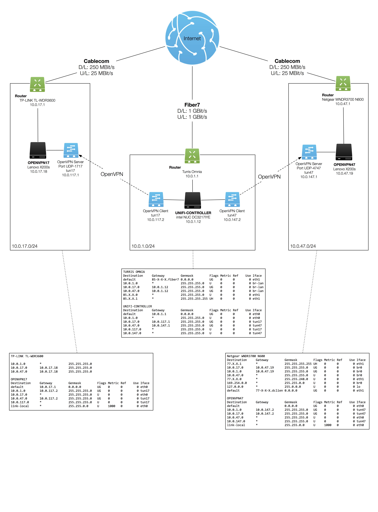

# openvpn
Startup scripts to establish Site-to-Site OpenVPNs between (at least) three sites

# Visualization

# Glossary
(please refer to visualization)

| Term | Description |
| ---- | ----------- |
| Local Site | 10.0.1.0/24 |
| Remote Sites | 10.0.17.0/24 and 10.0.47.0/24 |
| [OpenVPN] Client | UNIFI-CONTROLLER. The Linux computer device at the local site initiating the VPN tunnels to the remote sites |
| [OpenVPN] Server | OPENVPN17 and OPENVPN47. The Linux computers at remote sites listening on pre-defined UDP ports for incoming packets; OpenVPN endpoints |

# Pre-Requisites for a three site setup
* Three computers running Linux
  * I've chosen Debian 8.3 Jessie Stable for all three computers
  * I've bought a used intel NUC Mini-PC which serves as my Linux server within my home LAN
  * I've bought two used Lenovo X200s (ca. 150 CHF/each) to set them up at the remote sites. This way, I have always a keyboard and a monitor ready in case I have to perform support tasks on location. I've replaced the batteries and added the cheapest SSD drives I could get. Then I configured the laptops to not go to sleep when the lid is closed.
* UDP Port forwarding has to be enabled on the routers at the remote sites (TP-LINK TL-WDR3600 and Netgear WNDR3700) forwarding UDP packets coming from the Internet on Ports 1717 or 4747 respectively to the OPENVPN17/47 devices
* SSH Port forwarding should be enabled on the routers at the remote sites (TP-LINK TL-WDR3600 and Netgear WNDR3700) forwarding SSH packets to a) OPENVPN17 or OPENVPN47 respectively and b) (if available) a second Linux machine on the remote LAN in case you fuck up OpenVPN configuration OPENVPN17 or OPENVPN47 (and please remember: if you fuck up the whole Linux installation, you might need to commute to the remote location to fix things)
* Static Routes have to be configured on all three routers in case you want all devices on the local LANs to talk to remote LANs (otherwise, only OPENVPN17, OPENVPN47 and UNIFI-CONTROLLER will be able to ping devices in other LANs)
* Set up a (private) Git or SVN repository to store all configuration and scripts both for restoring previous versions as well as to have always an up-to-date source for all three machines. Manually or automatically sync configuration to OPENVPN17, OPENVPN47 and UNIFI-CONTROLLER

# Installation Instructions
TODO

# Speed
TODO
